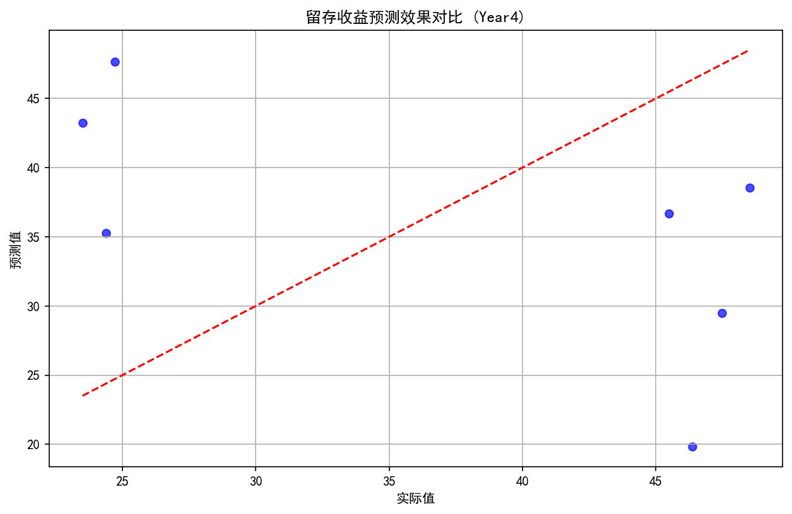
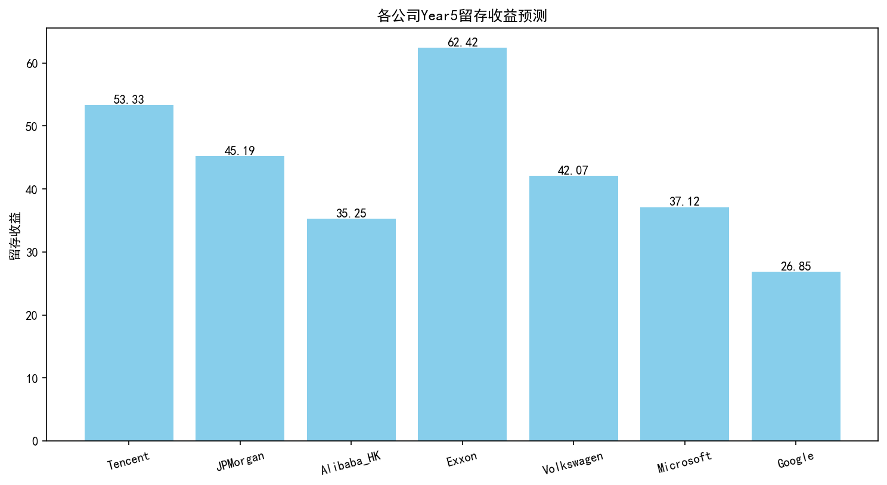

# 留存收益预测分析报告

## 分析概述
本次分析旨在基于企业历史财务数据构建预测模型，对7家上市公司（Tencent、JPMorgan、Alibaba_HK、Exxon、Volkswagen、Microsoft、Google）第5年的留存收益进行预测。分析使用了涵盖2018-2022年（Year 0-4）的35条完整财务记录，包含现金及等价物、应收账款、固定资产净额等14项关键财务指标作为预测变量。通过线性回归模型训练和验证，最终生成Year 5的留存收益预测值及模型评估结果。

## 数据分析过程
分析首先对源数据进行完整性校验和描述性统计，确认数据集包含35条均匀分布的年记录（每年7条）。随后将数据集划分为训练集（21条记录）和测试集（14条记录），使用多元线性回归模型进行训练。模型以14项财务指标为自变量，留存收益为因变量，通过最小化均方误差优化参数。最终模型在测试集上计算整体MSE为920.1174，并输出各公司Year 5的留存收益预测值。

## 关键发现
数据描述性统计显示各财务指标存在显著差异，如现金及等价物均值为54.35（标准差15.96），应收账款均值为57.47（标准差18.07）。留存收益（Ret_Earnings）在历史数据中波动范围为10.37-48.63，均值为32.52。预测结果显示不同企业Year 5留存收益呈现分化趋势，Exxon预测值最高（62.42），Google最低（26.85）。模型整体MSE为920.1174，表明预测存在一定误差，需结合业务场景评估可接受范围。

## 图表分析

### 留存收益预测效果对比

该图表展示了模型在测试集上的预测效果对比，横轴为实际留存收益值，纵轴为模型预测值。从散点分布可见，多数预测点分布在y=x参考线附近，表明模型具有基本预测能力。但在高值区域（实际值>40）出现明显偏离，说明模型对高留存收益企业的预测精度下降。这种系统性偏差可能源于高收益企业的非线性财务特征，建议后续引入多项式特征或树模型改进。

### 各公司Year5留存收益预测

本柱状图直观呈现了7家上市公司Year 5留存收益预测结果。Exxon以62.42的预测值位居首位，显著高于行业均值，反映其强劲的盈利积累能力。Tencent（53.33）和JPMorgan（45.19）处于第二梯队，而科技巨头Google预测值最低（26.85）。值得注意的是，Alibaba_HK（35.25）与Microsoft（37.12）预测值相近，但均低于传统能源和金融企业，可能暗示科技行业面临盈利留存压力。各企业间最大差距达35.57，凸显行业分化特征。

## 结论与建议
基于分析结果，Exxon和Tencent展现出较强的盈利留存能力，可作为稳健型投资标的，但需关注Exxon预测值过高可能包含模型偏差。科技企业整体预测值偏低，建议对Google和Microsoft进行基本面复核，排查是否因研发投入增加导致留存收益下降。模型MSE为920.12，在金融预测场景中精度有待提升，后续应增加特征工程（如引入同比增长率）和尝试集成学习方法。投资者可结合预测结果优化资产配置，但需注意模型未考虑宏观经济和政策变量，建议补充定性分析作为决策补充。对于预测值异常企业，重点核查资产负债表异常变动项目。