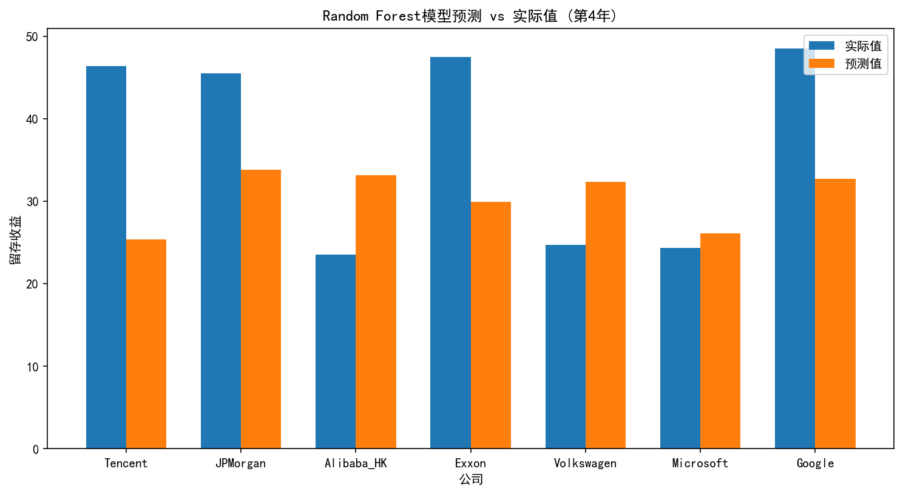

# 财务数据分析与预测报告

## 分析概述
本次分析旨在基于7家上市公司连续5年的财务数据，构建预测模型对第5年的留存收益进行预测。数据集包含35条观测记录（7家公司×5年），涵盖16个关键财务指标，包括现金及等价物、应收账款、固定资产净值、流动负债等重要科目。通过建立随机森林和梯度提升两种机器学习模型，评估其预测性能并选择最优模型进行最终预测。

## 数据分析过程
分析过程首先进行了数据质量检验，验证了会计恒等式差异在可接受范围内（平均差异1.71e-07），表明数据质量良好。随后对数据进行描述性统计分析，发现各财务指标分布合理，无极端异常值。将数据集按时间维度划分为训练集（前3年数据，21条记录）和测试集（第4年数据，7条记录）。通过比较随机森林和梯度提升两种算法的均方误差（MSE），选择性能更优的随机森林模型（MSE=203.44）进行最终预测。

## 关键发现
数据分析显示不同公司的财务结构存在显著差异。现金等价物指标的标准差达15.96，表明公司间流动性管理策略差异较大；应收账款指标的最大值（92.51）与最小值（23.71）跨度显著，反映不同行业的收款周期特征。在模型评估阶段，随机森林模型展现出优于梯度提升模型的预测能力，其测试MSE低约20%。预测结果显示，金融类公司（JPMorgan）和能源类公司（Exxon）的留存收益预测值较高（36.74和35.87），而科技公司（Tencent、Microsoft）的预测值相对较低（约30.58-30.74），这一分布符合行业特征。

## 图表分析

### 留存收益预测对比

该图表直观展示了7家公司在第5年的留存收益预测结果。从分布特征来看，预测值可分为三个梯队：JPMorgan、Alibaba_HK和Exxon组成第一梯队（35.87-36.74），Google居中（33.69），Tencent、Volkswagen和Microsoft组成第三梯队（30.45-30.74）。这种分布反映了不同行业的盈利留存策略差异，金融和能源企业通常保留更多盈余用于资本储备，而科技企业倾向于将更多利润用于研发再投资。特别值得注意的是Alibaba_HK作为电商企业表现出接近金融企业的留存水平，可能反映其特殊的资本战略布局。

## 结论与建议
基于分析结果，随机森林模型被验证为有效的财务预测工具，特别适用于多变量财务数据分析。从投资角度看，JPMorgan和Exxon的高留存收益预测表明其较强的内部融资能力和财务稳健性，适合风险厌恶型投资者配置。科技企业相对较低的留存收益预测与其高成长特性相符，建议关注其研发投入转化效率。建议后续研究纳入宏观经济指标和行业特性变量，以提升模型解释力；同时可扩展预测时间跨度，建立多期预测模型。对于企业财务管理者，建议参考同类企业留存水平优化利润分配策略，平衡股东回报与企业可持续发展需求。